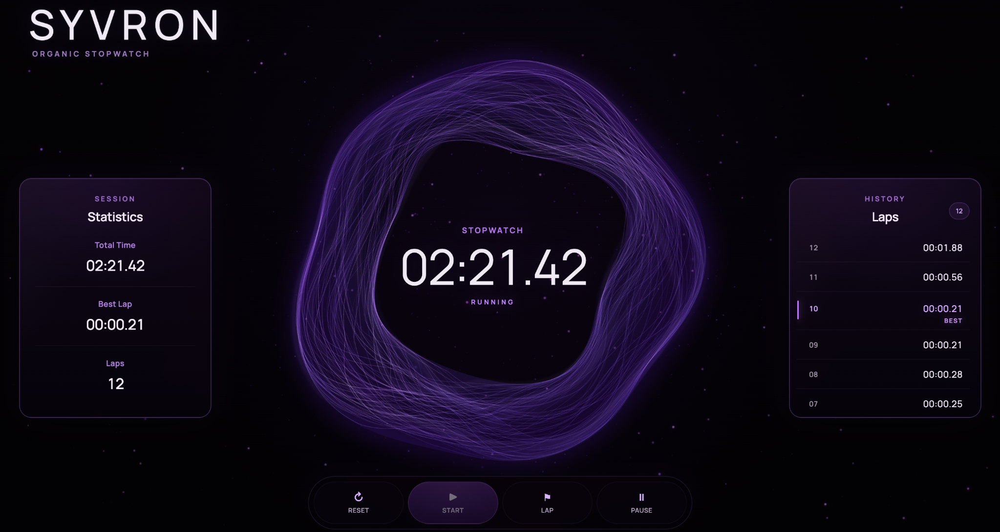
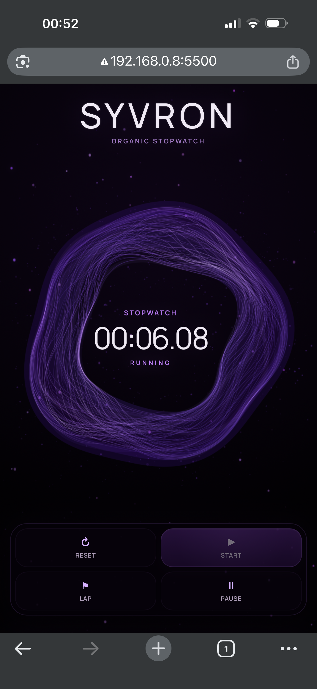

# SYVRON

> **Um cronômetro orgânico em que o tempo não é apenas contado — ele ganha comportamento.**


A **SYVRON** é um cronômetro interativo construído com HTML, CSS e JavaScript puro, cuja interface é habitada por uma criatura digital procedural renderizada em tempo real com Canvas 2D.

Mais do que exibir números e botões, o projeto transforma os estados do cronômetro em comportamento visual: **a SYVRON reage ao início da contagem, à pausa, à retomada, ao registro de voltas e ao reset**.

A criatura não é um GIF, vídeo ou animação pré-renderizada. Sua anatomia, fibras, movimento, iluminação, partículas e reações são calculados durante a execução da aplicação.

**A SYVRON não acompanha o cronômetro. A SYVRON é parte do cronômetro.**

---

## Preview

### Desktop



### Mobile



---

## Como surgiu a SYVRON

A SYVRON nasceu de uma pergunta simples:

**até onde uma interface pode deixar de parecer apenas uma interface?**

O ponto de partida era construir um cronômetro. Porém, em vez de seguir a abordagem tradicional — um visor, alguns botões e uma animação puramente decorativa — o projeto evoluiu para a ideia de criar uma presença digital que existisse junto ao tempo.

Essa presença se tornou **a SYVRON**.

Ela foi concebida como um organismo digital de aparência orgânica e extraterrestre, formado por fibras, membranas, luz e matéria suspensa. Seu comportamento não acontece de forma isolada: ele é influenciado pelo estado da aplicação.

Quando o cronômetro começa, a criatura responde.

Quando o tempo é pausado, seu fluxo muda.

Quando uma volta é registrada, uma manifestação percorre sua anatomia.

Quando a sessão é reiniciada, ela se reorganiza.

O objetivo passou a ser fazer com que **interação, estado e estética fossem partes do mesmo sistema**.

---

## Conceito visual

A identidade da SYVRON foi construída em torno de quatro ideias:

- **orgânica** — curvas, fibras e movimentos evitam uma aparência mecânica rígida;
- **misteriosa** — o fundo escuro e a paleta violeta criam uma presença quase extraterrestre;
- **reativa** — ações do usuário provocam manifestações visuais na criatura;
- **viva** — mesmo em repouso, a SYVRON continua apresentando movimento procedural.

A interface utiliza uma paleta fria baseada em violeta profundo, violeta elétrico, lilás frio e índigo, enquanto partículas ambientais ajudam a integrar a criatura ao espaço ao redor.

---

## Funcionalidades

- Cronômetro com precisão visual em centésimos de segundo;
- iniciar, pausar, retomar e reiniciar a sessão;
- registro de voltas durante a execução;
- cálculo individual da duração de cada volta;
- identificação automática da melhor volta;
- contador total de voltas;
- painel de estatísticas da sessão;
- histórico de voltas em ordem inversa, mantendo as mais recentes em destaque;
- estados visuais `READY`, `RUNNING` e `PAUSED`;
- reações específicas da criatura para `START`, `RESUME`, `PAUSE`, `LAP` e `RESET`;
- atalhos de teclado;
- layout responsivo para desktop, tablet e mobile;
- comportamento específico para dispositivos touch;
- suporte à preferência de movimento reduzido do sistema;
- atualização da animação interrompida quando a página fica oculta, evitando processamento visual desnecessário.

---

## Controles

| Ação | Interface | Teclado |
| --- | --- | --- |
| Iniciar | `Start` | `Espaço` |
| Pausar | `Pause` | `Espaço` |
| Retomar | `Resume` | `Espaço` |
| Registrar volta | `Lap` | `L` |
| Reiniciar | `Reset` | `R` |

Os controles são habilitados ou desabilitados de acordo com o estado atual do cronômetro, evitando ações incompatíveis com a sessão.

---

## A criatura procedural

A SYVRON é construída em tempo real.

Sua forma nasce de uma anatomia paramétrica dividida em limites internos e externos independentes. Sobre essa estrutura são distribuídas fibras procedurais, membranas, zonas de torção, pontos de energia e partículas.

O movimento não depende de sprites ou sequências de frames prontas. Cada frame é calculado a partir de funções matemáticas, estados temporais e parâmetros próprios da criatura.

### Anatomia

O módulo de anatomia funciona como uma espécie de **DNA visual**.

Ele define:

- massa externa;
- massa interna;
- regiões de torção;
- zonas de compressão;
- distribuição de destaques;
- assimetrias deliberadas.

Essa assimetria é importante para impedir que a criatura pareça uma forma geométrica perfeita ou artificialmente simétrica.

### Fibras

As fibras formam a estrutura visual dominante da SYVRON.

Cada uma possui características próprias, como:

- posição dentro da anatomia;
- espessura;
- opacidade;
- brilho;
- velocidade;
- fases procedurais;
- migração;
- deslocamento tangencial.

Os caminhos são recalculados continuamente, permitindo que o organismo se transforme sem perder sua identidade estrutural.

### Movimento

O sistema separa o **tempo visual** do **relógio procedural de movimento**.

Essa decisão permite alterar velocidade e direção sem provocar saltos abruptos na animação.

No estado de pausa, por exemplo, o movimento procedural pode inverter sua direção de forma contínua. START e RESUME produzem um impulso temporário, enquanto LAP e RESET possuem manifestações próprias.

### Curvas contínuas

Os pontos calculados para a anatomia e as fibras são convertidos em curvas Bézier cúbicas a partir de uma interpolação Catmull-Rom periódica.

Como a estrutura é circular, os pontos atravessam o início e o fim do conjunto de forma contínua. Isso evita uma emenda visível na região em que o caminho se fecha.

### Atmosfera e partículas

O projeto utiliza dois sistemas complementares de partículas:

1. um campo ambiental distribuído pela viewport;
2. matéria visual concentrada ao redor da própria criatura.

Parte do campo ambiental é pré-renderizada em uma camada estática, enquanto uma quantidade menor de partículas permanece em movimento. Essa separação reduz trabalho desnecessário durante a animação.

---

## Arquitetura

O JavaScript foi dividido em módulos com responsabilidades específicas.

```text
js/
├── main.js
├── timer-engine.js
├── laps-view.js
├── stats-view.js
├── ambient-particles.js
└── creature/
    ├── anatomy.js
    ├── geometry.js
    ├── fibers.js
    ├── motion.js
    ├── effects.js
    └── renderer.js
```

### `timer-engine.js`

Responsável exclusivamente pela lógica temporal:

- estados do cronômetro;
- tempo acumulado;
- pausa e retomada;
- registro das voltas;
- cálculo da melhor volta;
- formatação do tempo.

Ele não conhece a criatura nem depende da interface visual.

### `motion.js`

Controla o comportamento temporal da SYVRON:

- estado atual;
- transições;
- velocidade;
- direção;
- pulsos de reação;
- LAP;
- RESET;
- relógio procedural contínuo.

### `renderer.js`

Funciona como compositor visual.

Ele recebe o estado produzido pelo sistema de movimento e organiza a renderização de:

- corpo;
- membranas;
- fibras;
- atmosfera;
- highlights;
- reações;
- matéria ao redor da criatura.

### `fibers.js`

Produz os caminhos procedurais das fibras a partir da anatomia e do estado atual de movimento.

### `geometry.js`

Concentra a matemática geométrica compartilhada:

- raios internos e externos;
- interpolação;
- posicionamento entre limites;
- zonas de torção e compressão;
- continuidade da emenda circular.

### `effects.js`

Cuida das manifestações complementares:

- atmosfera;
- pontos de energia;
- brilho;
- poeira e matéria próxima ao organismo.

### Views

`laps-view.js` e `stats-view.js` mantêm a atualização da interface separada da lógica do cronômetro.

Essa divisão evita concentrar toda a aplicação em um único arquivo e mantém cada módulo com uma responsabilidade mais clara.

---

## Fluxo da aplicação

De forma simplificada:

```text
Interação do usuário
        │
        ▼
     main.js
      /   \
     ▼     ▼
TimerEngine   CreatureMotion
     │             │
     ▼             ▼
Views       CreatureRenderer
                   │
          ┌────────┼────────┐
          ▼        ▼        ▼
       Geometry  Fibers   Effects
                   │
                   ▼
                Canvas
```

O cronômetro e a criatura permanecem desacoplados: a lógica temporal pode funcionar sem conhecer os detalhes da renderização.

---

## Tecnologias utilizadas

### HTML5

Utilizado para a estrutura semântica da aplicação, incluindo:

- `main`;
- `header`;
- `section`;
- `aside`;
- `dl`, `dt` e `dd`;
- `output`;
- `button`;
- `ol`;
- elementos Canvas.

Também foram utilizados atributos ARIA para melhorar a comunicação de estados e atualizações dinâmicas.

### CSS3

Responsável pela composição visual e responsividade:

- CSS Grid;
- Flexbox;
- variáveis CSS;
- media queries;
- estados `hover`, `active`, `disabled` e `focus-visible`;
- layout específico para touch;
- `clamp()`;
- filtros e efeitos visuais;
- `prefers-reduced-motion`.

A versão mobile não é apenas uma redução proporcional do desktop: abaixo do ponto de quebra principal, a composição muda estruturalmente para uma organização vertical.

### JavaScript

O projeto utiliza JavaScript puro com ES Modules.

Entre os recursos aplicados estão:

- classes;
- módulos `import` / `export`;
- `performance.now()`;
- `requestAnimationFrame()`;
- manipulação do DOM;
- eventos de teclado e ponteiro;
- Canvas 2D;
- interpolação matemática;
- geração pseudoaleatória determinística;
- controle de estado;
- atualização baseada em delta time.

Nenhum framework JavaScript foi utilizado.

### Canvas 2D

O Canvas é responsável pela renderização procedural da criatura e dos campos de partículas.

Entre as técnicas utilizadas estão:

- curvas Bézier;
- gradientes lineares e radiais;
- composição com `screen`;
- blur;
- transformações de resolução para telas de alta densidade;
- desenho procedural frame a frame.

---

## Responsividade

A SYVRON possui composições específicas para diferentes tamanhos de tela.

No desktop, os painéis de estatísticas e voltas permanecem posicionados ao redor do palco central da criatura.

Em telas menores, o layout deixa de funcionar como uma simples versão reduzida dessa composição. A estrutura passa para uma organização vertical, preservando a criatura como elemento principal e reorganizando controles, estatísticas e histórico.

Também foram realizados ajustes específicos para:

- tablets em orientação horizontal;
- telas com pouca altura;
- celulares estreitos;
- interação por toque;
- densidade visual;
- custo de efeitos gráficos no mobile.

---

## Acessibilidade

Algumas decisões de acessibilidade presentes no projeto:

- botões semânticos;
- `output` para o tempo do cronômetro;
- regiões `aria-live` para atualizações importantes;
- estados desabilitados coerentes com o funcionamento da aplicação;
- foco visível para navegação por teclado;
- atalhos de teclado;
- conteúdo puramente decorativo ocultado de tecnologias assistivas quando apropriado;
- respeito a `prefers-reduced-motion`.

---

## Desempenho

Como a interface utiliza múltiplas camadas animadas, desempenho fez parte do desenvolvimento.

Entre as decisões adotadas estão:

- uso de `requestAnimationFrame`;
- criatura renderizada com alvo de aproximadamente 60 FPS;
- partículas ambientais animadas com frequência menor;
- limite de `devicePixelRatio` nos canvases;
- separação entre partículas estáticas e móveis;
- interrupção do loop visual quando a aba fica oculta;
- limite de delta time para evitar grandes saltos na simulação;
- redução de efeitos gráficos caros em dispositivos móveis.

O cronômetro não depende da quantidade de frames renderizados. A medição de tempo utiliza `performance.now()`, mantendo a lógica temporal separada da animação.

---

## Estrutura do projeto

```text
SYVRON/
├── assets/
│   ├── icons/
│   │   ├── android-chrome-192x192.png
│   │   ├── android-chrome-512x512.png
│   │   ├── apple-touch-icon.png
│   │   ├── favicon-16x16.png
│   │   ├── favicon-32x32.png
│   │   ├── favicon.ico
│   │   └── site.webmanifest
│   │
│   └── screenshots/
│       ├── syvron-desktop.png
│       └── syvron-mobile.png
│
├── css/
│   └── style.css
│
├── js/
│   ├── creature/
│   │   ├── anatomy.js
│   │   ├── effects.js
│   │   ├── fibers.js
│   │   ├── geometry.js
│   │   ├── motion.js
│   │   └── renderer.js
│   │
│   ├── ambient-particles.js
│   ├── laps-view.js
│   ├── main.js
│   ├── stats-view.js
│   └── timer-engine.js
│
├── .gitignore
├── index.html
├── LICENSE
└── README.md
```

---

## Como executar

A SYVRON não possui processo de build nem dependências de framework.

Clone o repositório:

```bash
git clone <URL-DO-REPOSITORIO>
```

Entre na pasta:

```bash
cd syvron
```

Abra o projeto por meio de um servidor local.

No VS Code, uma opção é utilizar a extensão **Live Server** e abrir o `index.html`.

> Como o projeto utiliza ES Modules, executá-lo por um servidor local evita restrições que alguns navegadores aplicam ao carregamento de módulos diretamente pelo protocolo `file://`.

---

## Live Demo

A demonstração pública será vinculada aqui após a publicação do projeto.

---

## O que este projeto representou

A SYVRON começou como um exercício de construção de interface, mas acabou exigindo decisões que vão além de montar componentes visuais.

Durante o desenvolvimento foram trabalhados conceitos como:

- separação de responsabilidades;
- arquitetura modular;
- controle explícito de estado;
- animação independente de FPS;
- matemática aplicada à interface;
- renderização procedural;
- otimização de Canvas;
- responsividade orientada à composição;
- acessibilidade;
- manutenção de código;
- refinamento iterativo sem perder comportamentos já aprovados.

Um dos maiores aprendizados foi perceber que uma interface pode comunicar estado sem depender apenas de texto, cor ou ícones.

Na SYVRON, **o comportamento da própria criatura se torna parte do feedback da aplicação**.

---

## Autor

Desenvolvido por **Chrystiano** como projeto de estudo e portfólio em desenvolvimento front-end.

---

## Licença

Este projeto está disponível sob a licença **MIT**.

Consulte o arquivo `LICENSE` do repositório para mais informações.

---

<p align="center">
  <strong>SYVRON</strong><br>
  <sub>Organic Stopwatch</sub>
</p>
